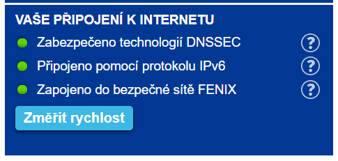

# PowerDNS a DNSSEC

**PowerDNS** je open-source DNS server, který rád už roky používám a **DNSSEC** je poměrně komplikovaná ochrana domén, aby klient měl jistotu, že DNS záznamy k doméně mu dodává skutečně DNS server k tomu určený. Ochrana funguje na principu podepisování záznamů pomocí privátního klíče a ověřování jejich pravosti veřejným klíčem, který musí být publikován do nadřazené autority, tedy například do registru .cz domén. Registr zase podepisuje svoje údaje a veřejný klíč k tomuto podpisu je k nalezení v kořenových serverech. Všechny tyto podpisy na jednotlivých úrovních musí sedět, jinak doména nebude dostupná.

Toto všechno celé stojí a padá na tom, zda tyto podpisy ověřuje DNS resolver, neboli DNS server, kterého se na doménu dotazuje klient. Pokud klient používá resolver bez podpory DNSSEC, je úplně jedno, že je doména pomocí DNSSEC zabezpečena, doména v takovém případě není nijak chráněna. I přesto se implementace DNSSECu vyplatí, nic lepšího není a naštěstí většina veřejných DNS resolverů již DNSSEC validuje a poskytovatelé internetového připojení se také v tomto ohledu zlepšují. Jestli používáte resolvery s podporou DNSSECu si můžete ověřit například na webu [nic.cz](https://www.nic.cz/).



Pokud nemáte zabezpečeno, doporučuji změnit DNS resolvery například na ty notoricky známé od Googlu: 8.8.8.8, 8.8.4.4 nebo Cloudflare: 1.1.1.1. Ideálně si udělat vlastní validující resolver, ale to je na jiné povídání.

## Implementace DNSSEC v PowerDNS

Na to jak DNSSEC na první pohled působí složitě, se jeho konfigurace postupně výrazně zjednodušila. Pokud se u PowerDNS používá jako backend MySQL databáze, je potřeba mu říci, aby si na DNSSEC připravil tabulky. V konfiguračním souboru pdns.conf je to volba:

`gmysql-dnssec`

Restartujeme PowerDNS daemona a je připraveno na zapnutí DNSSECu u jednotlivých domén (zón) pomocí nástroje **pdnsutil**:

```shell
pdnsutil secure-zone meziblog.cz
```

PowerDNS nyní vše zařídil a doména meziblog.cz má již DNSSEC aktivní. Dalším krokem je přenést otisk klíče k nadřazené autoritě, tedy do registru .cz domén. Zobrazíme si tedy informace o naší podepsané zóně:

```shell
pdnsutil show-zone meziblog.cz
```

Výsledek vypadá nějak takto:

```shell
keys:
ID = 3 (CSK), flags = 257, tag = 57954, algo = 13, bits = 256     Active ( ECDSAP256SHA256 )
CSK DNSKEY = meziblog.cz. IN DNSKEY 257 3 13 lWh9eNdDt5d6Xkc1VVxPhhYeFRckbiJYpqZnar7TtkN71G1tSpgRwc0amjaNB3XbweK+1RCfDxTAqPZnDUvMZg== ; ( ECDSAP256SHA256 )
DS = meziblog.cz. IN DS 57954 13 1 1e6598956d9971a0e29d70437f5d17a0a098cffc ; ( SHA1 digest )
DS = meziblog.cz. IN DS 57954 13 2 71d36fab0a887d698ea0708b1ec0b31958a22bfb3bc25bc836d4e670ba2f8d62 ; ( SHA256 digest )
DS = meziblog.cz. IN DS 57954 13 4 104d4793d0ab6d008e4da44abeccc0338198b0461693c4fb869be23e70202de671ea0444ee378d8c4e433bdac1c81971 ; ( SHA-384 digest )
```

Důležitý je řádek obsahující DNSKEY. Tento otisk klíče je potřeba vzít, vytvořit u registrátora sadu klíčů KEYSET pro naší doménu a do něj tento otisk klíče vložit. Naštěstí existuje možnost, jak vložení klíče do registru zcela automatizovat. Správce domény tuto možnost musí podporovat, ale cz.nic správce .cz domény je v tomto směru velkým průkopníkem a byli první kdo tuto možnost zavedl.

Stačí jen zveřejnit DNSSEC klíč pro naší doménu pomocí CDNSKEY a CDS záznamu:

```shell
pdnsutil set-publish-cdnskey meziblog.cz
pdnsutil set-publish-cds meziblog.cz
```

To je celé, teď už je třeba jen počkat. Nejprve si správce domény musí všimnout, že má doména CDNSKEY publikovaný, což může jeden až dva dny trvat. O nalezení záznamu bude majitel a administrátor domény informován emailem. Po týdnu, pokud CDNSKEY v zóně zůstane, správce domény přidá automatický KEYSET k doméně s naším otiskem klíče a je hotovo, doména je zabezpečena pomocí DNSSEC.

# NSEC3

Na závěr ještě drobný dodatek. Je vhodné používat místo původních NSEC záznamů, které slouží resolverům pro ověřování existence záznamu, novější NSEC3. NSEC záznamy mají jeden nepříjemný bezpečnostní problém, je možné díky zřetězení těchto záznamů vytáhnout obsah celé zóny. NSEC3 tento problém řeší posíláním hashe místo jména. Více informací k tomuto tématu je k dispozici na webu [nic.cz](https://www.nic.cz/nsec3/).

PowerDNS nastavuje NSEC3 záznamy tímto příkazem:

```shell
pdnsutil set-nsec3 meziblog.cz '1 0 1 ab'
```

Následně stačí provést přeuspořádání záznamů v zóně a navýšení sériového čísla zóny, aby se o změnách dozvěděly slave DNS servery:

```shell
pdnsutil rectify-zone meziblog.cz
pdnsutil increase-serial meziblog.cz
```