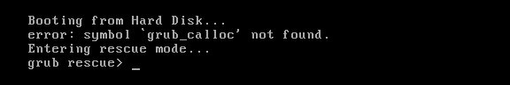

# Oprava bootloaderu Grub uvnitř KVM virtuálního serveru

Z nějakého důvodu mi po restartu přestaly nabíhat KVM virtuální servery. Možná jsem já udělal něco špatně nebo se jedná o nějaký bug v Debianu, který primárně na virtuální servery používám. Každopádně boot končil s chybou:



Nevím přesně co chyba ``error: symbol `grub_calloc` not found.`` znamená, ale je potřeba opravit instalaci bootloaderu Grub, aby virtuální server mohl opět nabootovat.

Nejprve je potřeba virtuální server úplně zastavit a namountovat diskový oddíl virtuálního serveru s root adresářem. Ať už je image disku uložen v souboru nebo jako LVM logický disk, není možné ho namountovat přímo.

Jako první si disk připojíme jako loop zařízení:

```shell
losetup -Pf /dev/vg0/disk1
```

Připojená loop zařízení je možné zobrazit pomocí:

```shell
losetup -a
```

Vytvoříme si adresář do kterého připojíme diskový oddíl (p1) z /dev/loop0:

```shell
mkdir /mnt/rescue
mount /dev/loop0p1 /mnt/rescue/
```

Abychom mohli pracovat s diskem, připojíme si do /mnt/rescue také systémové adresáře proc, sys, tmp, dev:

```shell
for fs in {proc,sys,tmp,dev}; do mount -o bind /$fs /mnt/rescue/$fs; done
```

Nyní si adresář /mnt/rescue spustíme v chrootu, abychom se dostali dovnitř našeho virtuálního serveru:

```shell
chroot /mnt/rescue
```

Uvnitř chrootu spustíme instalaci grubu na náš disk /dev/loop0:

```shell
grub-install /dev/loop0
```

Grub by měl být opraven a můžeme začít uklízet. Ukončíme chroot a odmountujeme systémové adresáře:

```shell
exit
for fs in {proc,sys,tmp,dev}; do umount /mnt/rescue/$fs; done
```

Odmountujeme samotný root adresář našeho virtuálního serveru a zrušíme loop zařízeni disku:

```shell
umount /mnt/rescue
losetup -d /dev/loop0
```

Vše je nyní dokončeno a po spuštění virtuálu již naběhl bez problémů.
